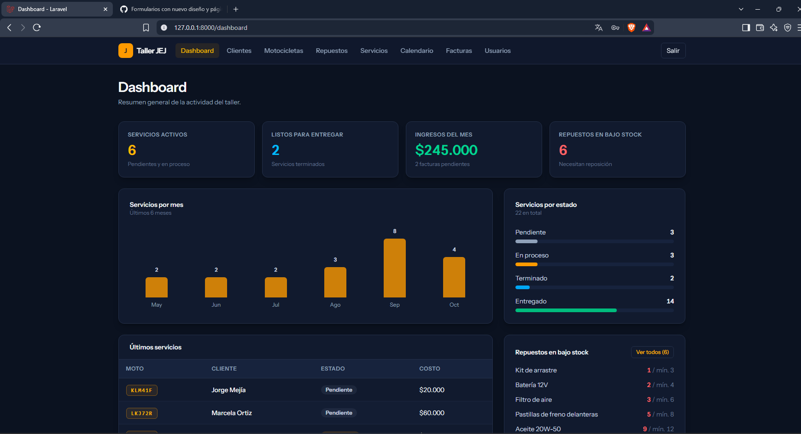
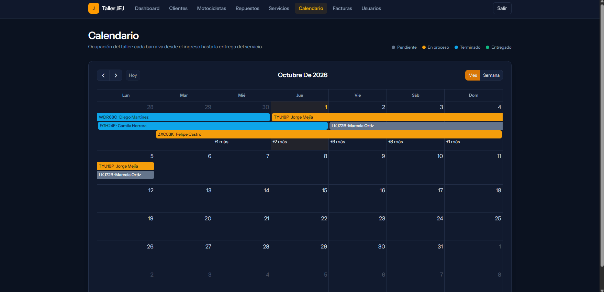
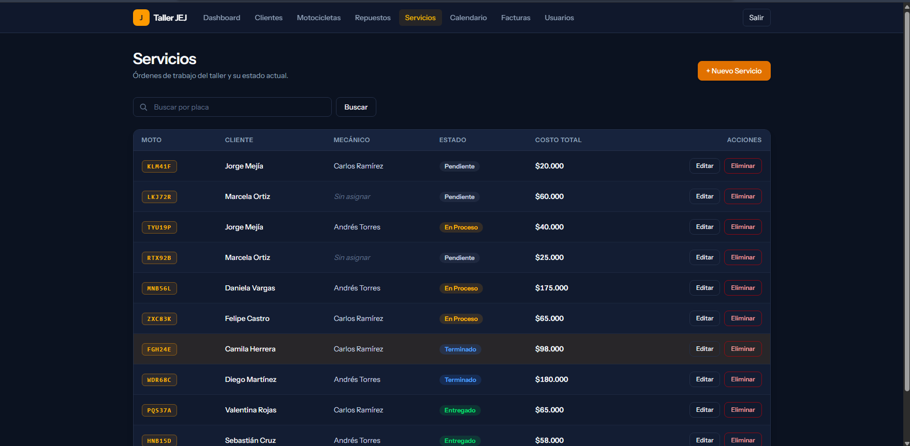
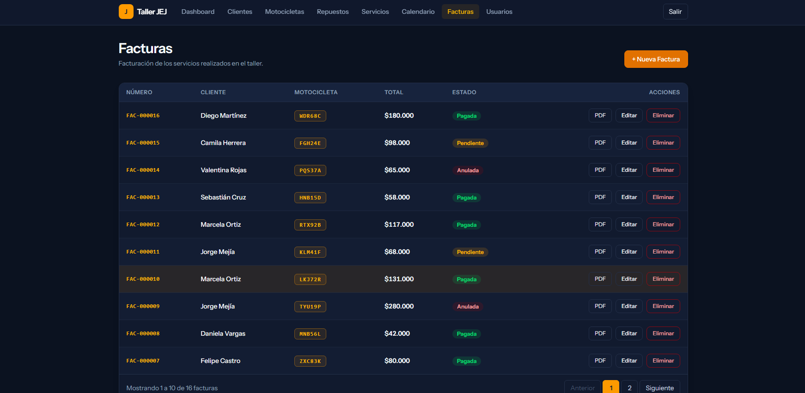
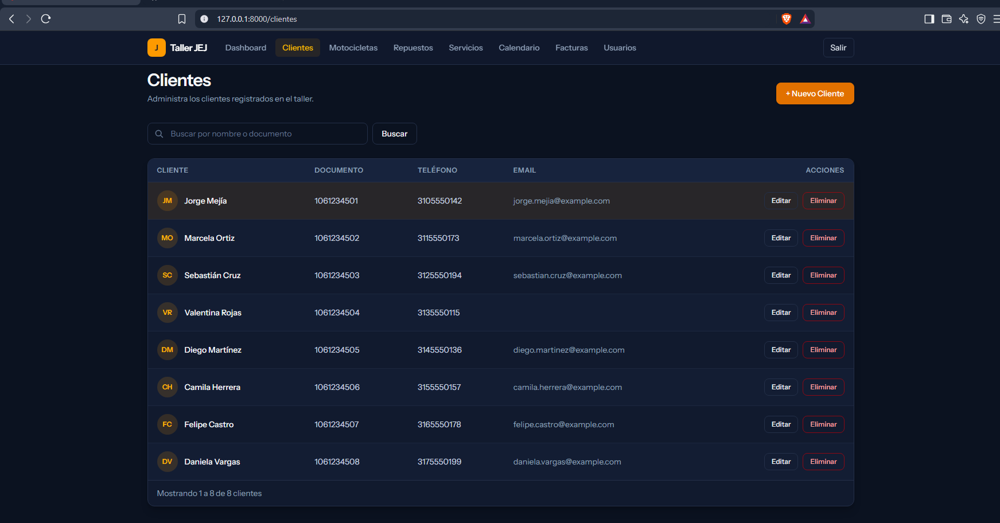

# Taller JEJ


Aplicación web para la administración de clientes, servicios e inventario en un taller de motocicletas. Reescritura del proyecto de grado original (Blade) usando un stack más moderno: Laravel + Inertia.js + Vue 3.

> Proyecto de grado — Tecnología en Desarrollo de Software, Corporación Universitaria para el Desarrollo Empresarial y Social Misión Paz.

## Capturas de pantalla

### Dashboard

Resumen de la actividad del taller: servicios por estado, ingresos del mes, repuestos en bajo stock y carga de trabajo de los mecánicos.



### Calendario de disponibilidad

Cada barra va desde el ingreso hasta la entrega del servicio, con el color de su estado.



### Servicios

Órdenes de trabajo con su mecánico, estado y costo total.



### Facturas

Facturación con número consecutivo, estado de pago y descarga en PDF.



### Clientes



## Stack tecnológico

- **Backend:** Laravel 13 (PHP 8.5)
- **Frontend:** Inertia.js + Vue 3 + Tailwind CSS
- **Base de datos:** PostgreSQL 18
- **Testing:** Pest
- **Calidad de código:** Pint (estilo PHP), PHPStan/Larastan (análisis estático) y `vp check` (formato y lint del frontend)
- **Integración continua:** GitHub Actions
- **Autorización:** Policies + Form Requests (sin middleware de rol genérico)

## Funcionalidades

- Página de inicio pública con información del taller
- Autenticación propia (login con límite de intentos, sin paquete de scaffolding)
- Roles de usuario: **admin**, **recepcionista**, **mecánico**
- Dashboard con métricas: servicios por mes y por estado, repuestos en bajo stock y disponibilidad de mecánicos
- Calendario de disponibilidad de servicios (FullCalendar)
- CRUD completo de:
    - **Clientes**
    - **Motocicletas** (asociadas a un cliente)
    - **Repuestos** (con alerta de bajo stock)
    - **Servicios** (órdenes de trabajo con descuento automático de inventario y cálculo de costos)
    - **Facturas** (una por servicio terminado, con número consecutivo, estado de pago y descarga en PDF)
    - **Usuarios** (solo administradores, con eliminación lógica y bloqueo de auto-eliminación)
- Correo automático al cliente cuando su servicio se marca como terminado
- Eliminación lógica (soft deletes) en todos los módulos
- Un mecánico solo ve los servicios que tiene asignados; puede recibir permiso especial para crear servicios
- Suite de pruebas automatizadas con Pest (61 tests / 173 aserciones)

## Instalación

```bash
# 1. Clonar el repositorio
git clone https://github.com/mewi6969/taller-JEJ-vue.git
cd taller-JEJ-vue

# 2. Instalar dependencias de PHP
composer install

# 3. Instalar dependencias de JavaScript
npm install

# 4. Configurar el entorno
cp .env.example .env
php artisan key:generate

# 5. Configurar la base de datos en .env
# DB_CONNECTION=pgsql
# DB_DATABASE=taller_motos_vue
# DB_USERNAME=tu_usuario
# DB_PASSWORD=tu_password

# 6. Ejecutar migraciones
php artisan migrate

# 7. (Opcional) Poblar con datos de prueba
php artisan db:seed
```

## Ejecutar el proyecto

Necesitas dos terminales abiertas al mismo tiempo:

```bash
# Terminal 1: servidor de Laravel
php artisan serve

# Terminal 2: compilación de assets (Vite)
npm run dev
```

Accede en `http://localhost:8000`.

**Usuario de prueba (admin):**

- Correo: `admin@tallermotos.com`
- Contraseña: `12345678`

## Ejecutar los tests

```bash
php artisan test
```

## Revisiones de calidad

Las mismas revisiones que corre GitHub Actions en cada push se pueden ejecutar en local con un solo comando:

```bash
composer ci:check
```

Ejecuta, en cadena: formato y lint del frontend, tipos de Vue, estilo PHP (Pint), análisis estático (PHPStan) y las pruebas.

## Autor

**Erwin Adolfo Grizales Buitrago**
Tecnología en Desarrollo de Software
Director de tesis: Wilder Ordoñez — Codirector: Jaime Andrés Jirón
